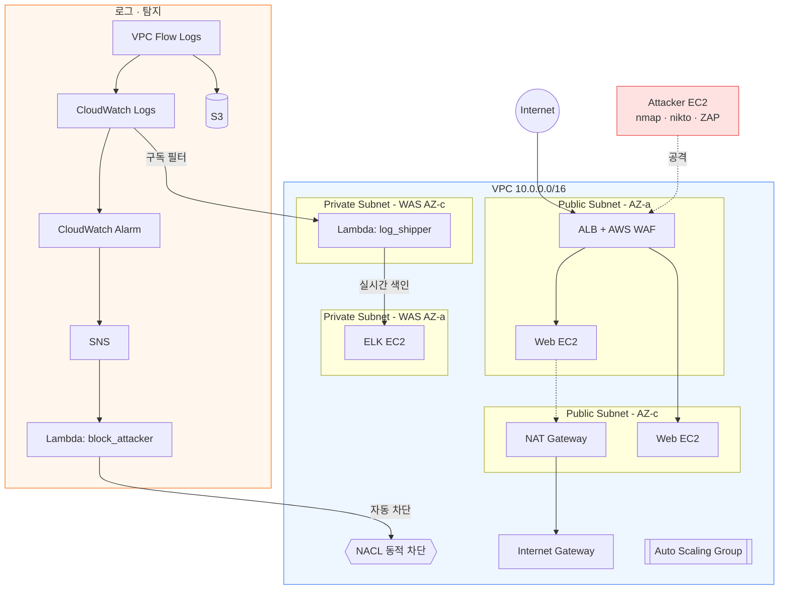

<div align="center">

# AWS 3-Tier Cloud SOC Monitoring

**AWS 3-Tier 인프라 기반 클라우드 보안관제 파이프라인 구축 프로젝트**

📝 **[전체 진행 과정, 이 블로그에서 매일 기록하고 있습니다 →](https://dev-heega.tistory.com/)**


[](https://www.terraform.io/)
[](https://aws.amazon.com/)
[](https://www.python.org/)
[](https://www.elastic.co/)
[](https://github.com/features/actions)
[](https://dev-heega.tistory.com/)

</div>

<br>

---

<br>

## 프로젝트 목적

침해 시도를 탐지하고 대응하는 클라우드 보안관제 파이프라인을, 네트워크 설계부터 공격 재현·탐지·자동 대응·SIEM 통합·CI/CD까지 직접 구축해 실무형 인프라 보안 역량을 증명하기 위한 개인 프로젝트다.

**최소 구성 · 재현 가능성 · 설계 의도 설명 가능**을 원칙으로 삼았다.

<br>

## 기간 및 인력 구성

| 항목 | 내용 |
|---|---|
| 기간 | 2026.08.11 ~ 2026.09.07 (실 작업 기간 약 2주, 중간 8.18~9.3 모의관제 프로젝트 병행) |
| 인력 | 1인 (기획·설계·구현·문서화 전 과정 단독 수행) |

<br>

## 주요 업무 및 상세 역할

| 영역 | 수행 내용 |
|---|---|
| 네트워크 설계 | VPC 3-Tier(Public/Private, 2AZ) 및 SG/NACL 계층 방어 구조 Terraform으로 설계·구현 |
| 로그 수집 | CloudTrail, VPC Flow Logs를 CloudWatch Logs + S3 이중 저장 구조로 구축 |
| 공격 재현·탐지 | nmap/nikto로 공격 재현, 수집된 로그 기반 탐지 결과 검증 |
| 자동 대응 | CloudWatch Alarm + SNS + Lambda로 이상 트래픽 자동 차단 흐름 구현, 실측 데이터 기반 임계값 튜닝 |
| 가용성 확보 | ALB + Auto Scaling Group 구성, 장애 시뮬레이션으로 자동 복구 검증 |
| CI/CD | GitHub Actions + OIDC 인증 기반 Terraform Plan/Apply 파이프라인 구축, S3 Backend로 원격 State 관리 |
| SIEM 통합 | Docker 기반 ELK(Elasticsearch·Kibana·Elasticvue) 구축, Lambda 기반 실시간 로그 파이프라인 및 Kibana 대시보드 설계 |
| 애플리케이션 방어 | AWS WAF(OWASP 관리형 규칙) 적용, OWASP ZAP으로 적용 전/후 비교 및 FPR/FNR 자체 측정 |
| 문서화 | 전 과정 트러블슈팅을 포함한 블로그 14편 작성, 최종 보고서·아키텍처 다이어그램 정리 |

<br>

---

<br>

## 아키텍처



<sub>Mermaid 코드로 관리되어 GitHub에서 자동 렌더링된다. 인프라 변경 시 코드만 수정하면 다이어그램도 함께 갱신된다.</sub>

<br>

---

<br>

## 기술 스택

`Terraform` `GitHub Actions` `EC2` `Lambda` `VPC/ALB/NAT` `Security Group` `NACL` `AWS WAF` `IAM(OIDC)` `CloudTrail` `CloudWatch` `Elasticsearch` `Kibana` `Elasticvue` `Python` `nmap` `nikto` `OWASP ZAP`

<br>

---

<br>

## 학습 내용 및 인사이트

**계기**

평소 뉴스 클리핑을 하며 API 키·접근 토큰 노출 관련 사고 기사를 자주 접했다. 위즈(Wiz)의 "클라우드 위협 2026" 보고서에 따르면 2025년 클라우드 침해사고의 초기 진입 경로 중 노출된 시크릿이 21%를 차지했고, 국내 개인정보보호위원회도 2026년 6월 "장기 자격증명 대신 임시 자격증명을 사용하라"고 공식 권고했다. 새로운 공격 기법이 아니라 코드에 박아둔 오래된 키 하나가 여전히 가장 흔한 침해 경로라는 점이 인상 깊었다.

이 문제의식을 CI/CD 파이프라인 설계에 반영했다. GitHub Actions가 AWS를 호출할 때 Access Key를 Secret에 저장하는 대신, OIDC로 매번 짧은 유효시간의 임시 자격증명을 발급받도록 구성해 저장된 장기 키 자체를 없애는 방향으로 설계했다.

**기술적으로 확인한 것**

- IaC로 관리하지 않은 리소스(콘솔 직접 설정)는 인프라 재구축·CI 자동화 과정에서 예상치 못한 방식으로 어긋난다는 것을 실제 장애(state 불일치로 인한 리소스 중복, Flow Log 유실 등)로 직접 경험함
- `create_before_destroy` 같은 Terraform lifecycle 옵션이 리소스 자체의 생성/삭제 순서는 보장해도, 그 리소스를 참조하는 다른 리소스의 갱신 순서까지는 보장하지 않는다는 것을 트러블슈팅을 통해 확인함
- 탐지 임계값은 처음부터 정답을 맞히는 것이 아니라, 배경 트래픽을 실측하고 그 위에 안전마진을 두는 방식으로 조정해야 한다는 것을 직접 겪음
- WAF 등 보안 장비의 효과는 "장비를 달았다"가 아니라 "적용 전/후를 같은 조건에서 비교했을 때 무엇이 달라지는가"로 증명해야 설득력이 있다는 것을 체감함

**느낀 점**

최근 보안 업계에서는 AI 에이전트가 데이터베이스·API·각종 도구를 넘나들며 스스로 판단하고 행동하는 사례가 늘면서, 기존 IAM 방식만으로는 접근 통제에 한계가 있다는 이야기가 자주 나온다. "누가·무엇에·얼마나 접근하는지"에 따라 접근키 생성·갱신·폐기 자체를 자동화해야 한다는 방향이 이런 흐름의 핵심으로 보인다. 이번 프로젝트에서 Lambda 함수(`block_attacker`, `log_shipper`)마다 필요한 최소 권한만 부여한 전용 IAM Role을 따로 만들고, GitHub Actions에는 장기 키 대신 OIDC 임시 자격증명을 적용한 것도 같은 방향의 축소판이라고 생각한다. 앞으로 SOC 환경에 자동화된 판단 주체(에이전트, 파이프라인 등)가 더 깊이 들어올수록, 이게 정확히 무엇에 접근할 수 있고 그 권한이 언제 만료되는지를 설계 단계부터 관리하는 역량이 점점 더 중요해질 것 같다.

<br>

---

<br>

## 참고자료

전체 진행 과정을 문제→원인→해결 구조로 기록했다. 아래 접힌 목록은 레포 안의 기록이며, 정리된 형태로도 [개인 블로그](https://dev-heega.tistory.com/)에서 확인할 수 있다.

<details>
<summary><b>📖 진행 기록 전체 보기 (14편)</b></summary>
<br>

1. [계정 세팅 & VPC 네트워크 설계](./blog/2026-08-11-aws-3tier-soc-setup.md) — AWS 계정 보안 설정, 3-Tier VPC 네트워크 설계
2. [인프라 배포 및 로그 수집 체계 구축](./blog/2026-08-13-aws-3tier-soc-deploy-logging.md) — Terraform 배포, CloudTrail/Flow Logs 구성
3. [공격 재현 및 Flow Logs 탐지 검증](./blog/2026-08-13-aws-3tier-soc-attack-simulation.md) — nmap 공격 재현, 로그 기반 탐지 검증
4. [웹 취약점 스캔 및 하드닝](./blog/2026-08-13-aws-3tier-soc-nikto-hardening.md) — nikto 스캔, Apache 하드닝
5. [SOAR 파이프라인 구축 및 임계값 튜닝](./blog/2026-08-14-aws-3tier-soc-soar-pipeline.md) — Lambda 자동 차단, 실측 기반 임계값 조정
6. [ALB 도입을 위한 보안 그룹 재설계](./blog/2026-08-14-aws-3tier-soc-sg-refactor.md) — SG 분리, Terraform lifecycle 트러블슈팅
7. [ALB + Auto Scaling 구축](./blog/2026-08-14-aws-3tier-soc-alb-asg.md) — 가용성 확보, user_data 트러블슈팅
8. [인프라 재현성 및 장애 시뮬레이션 검증](./blog/2026-08-15-aws-3tier-soc-failover-test.md) — destroy/재구축, 장애 자동 복구 검증
9. [GitHub Actions CI/CD 파이프라인 구축](./blog/2026-08-15-aws-3tier-soc-cicd-pipeline.md) — OIDC 인증, state 불일치 사고 대응
10. [VPC Flow Log 유실 발견 및 복구](./blog/2026-08-15-aws-3tier-soc-flowlog-recovery.md) — IaC 편입, S3 이중 저장 구현
11. [ELK 스택 구축 및 실시간 로그 파이프라인](./blog/2026-08-16-aws-3tier-soc-elk-pipeline.md) — Docker ELK, Lambda 기반 실시간 색인
12. [Kibana 대시보드 구성](./blog/2026-08-16-aws-3tier-soc-kibana-dashboard.md) — SOC 분석 흐름 기반 대시보드 설계
13. [AWS WAF 구축 및 OWASP ZAP 정량 검증](./blog/2026-08-18-aws-3tier-soc-waf-verification.md) — WAF 적용 전/후 비교, FPR/FNR 측정
14. [Elasticvue 연동](./blog/2026-09-06-aws-3tier-soc-elasticvue-integration.md) — CORS 트러블슈팅, 클러스터 GUI 연동

</details>

<br>

> 최종 보고서(Word), 노션 정리본, 발표용 PPT는 프로젝트 종료 후 별도로 이 섹션에 링크 추가 예정.

<br>

---

<br>

## 레포 구조

```
.
├── terraform/          # 인프라 정의 (VPC, EC2, ALB/ASG, Lambda, WAF, ELK 등)
├── lambda/             # Lambda 함수 소스 (block_attacker, log_shipper)
├── docker/elk/         # ELK 스택 Docker Compose 설정
├── blog/               # 일자별 진행 기록
└── .github/workflows/  # CI/CD 파이프라인
```

<br>

---

<br>

## 로컬에서 재현하기

```bash
git clone https://github.com/heeega/aws-3tier-soc-monitoring.git
cd aws-3tier-soc-monitoring/terraform

terraform init
terraform plan -var="alert_email=your-email@example.com"
terraform apply -var="alert_email=your-email@example.com"
```

> `admin_ips` 등 환경별 값 조정이 필요하며, ELK Docker Compose 등 일부 구성은 자동 배포되지 않고 수동 설정 절차가 필요하다. NAT Gateway, ALB, EC2 등 시간당 과금 리소스가 포함되어 있어 실습 종료 후 `terraform destroy`로 정리해야 한다.